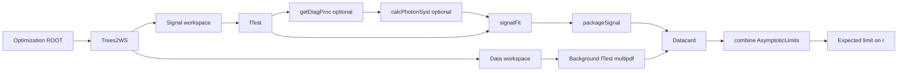

# flashggFinalFit hands-on tutorial (bbgg Run 3)

End-to-end mini final fit for **MX=1000, MY=125**: ROOT → Trees2WS → signal/background modelling → datacard → `combine`, for three limits:

1. **Resolved** — `resolved_cat0` + `resolved_cat1`
2. **Boosted** — single `boosted` channel
3. **All** — `combineCards` boosted + resolved

---

## 0. 阅读导引

| 层级 | 章节 | 用途 |
|------|------|------|
| 快速跑通 | §1–§3 | 环境、样本、一键 `./run_tutorial.sh` |
| 深入理解 | §7–§15 | 物理/统计背景、分步命令、各模块 config、FAQ |

本 tutorial 固定物理点 **MX=1000, MY=125**：重共振 X 质量 1000 GeV，中间态 Y 质量 125 GeV（接近 SM Higgs）。limit 解读见 §12 与 [`outputs/GOLDEN.md`](outputs/GOLDEN.md)。

**Pipeline 总览**（tutorial 默认省略虚线步骤）：



Tutorial 默认 signal 路径：`fTest → signalFit(--skipSystematics) → packageSignal`。

---

## 1. Environment

```bash
export CMSSW_BASE=/path/to/CMSSW_14_1_0_pre4   # flashggFinalFit + HiggsAnalysis/CombinedLimit
cd $CMSSW_BASE/src/flashggFinalFit/tutorial
```

Build background fTest once if needed:

```bash
make -C $CMSSW_BASE/src/flashggFinalFit/Background
```

Optional: copy [`tutorial.env.example`](tutorial.env.example) to `tutorial.env` and `source` it (`MX`, `MY`, `SKIP_SIGNAL_SYST`, sample path).

---

## 2. Input samples

Six ROOT files (see `sync_tutorial_samples.sh`):

| Channel | Files |
|---------|-------|
| Resolved | `signal/signal_1000_125_analysis_pnn_cat{0,1}.root`, `data/data_resolved_1000_125_pnn_cat{0,1}.root` |
| Boosted | `signal/output_NMSSM_signal.root`, `data/allData.root` |

```bash
./sync_tutorial_samples.sh fetch
./sync_tutorial_samples.sh verify
```

Override: `export TUTORIAL_SAMPLES_ROOT=/your/path`.

---

## 3. One-command run

```bash
./run_tutorial.sh all          # resolved → boosted → combine-all
./run_tutorial.sh resolved
./run_tutorial.sh boosted
./run_tutorial.sh combine-all  # needs existing resolved + boosted datacards
```

Logs:

- `outputs/resolved/MX1000/MY125/combine/combine_resolved.log`
- `outputs/boosted/MX1000/MY125/combine/combine_boosted.log`
- `outputs/all/MX1000/MY125/combine/combine_all.log`

Reference limits: [`outputs/GOLDEN.md`](outputs/GOLDEN.md).

Signal / background 拟合默认走 **config**（[`configs/signal_*.py`](configs/signal_resolved.py)、[`background_*.py`](configs/background_resolved.py) → `RunSignalScripts.py` / `RunBackgroundScripts.py`）。调试时可 `export TUTORIAL_USE_CLI=1` 改走底层 CLI（§9 附录）。

### 3.1 产物与诊断图（两处路径）

flashggFinalFit **默认**把中间结果写在包内 `Signal/`、`Background/` 下；tutorial driver 会把 **limit、datacard、拟合图** 等镜像到 `tutorial/outputs/`。为在 AFS/EOS 上保持稳定，git **只跟踪** limit log、datacard、filled config（见 [`outputs/README.md`](outputs/README.md)）；**plot / ROOT 仅本地保留**。

| 类型 | flashggFinalFit 内（运行后立即可见） | tutorial `outputs/` 镜像 | git |
|------|--------------------------------------|--------------------------|-----|
| Signal fTest 图 | `Signal/outdir_${SIG_EXT}/fTest/Plots/` | `outputs/.../signal/plots_cat*/fTest/` 或 `signal/plots/fTest/` | 否 |
| Signal fit 图 | `Signal/outdir_${SIG_EXT}/signalFit/Plots/` | `outputs/.../signal/plots_cat*/signalFit/` 或 `signal/plots/signalFit/` | 否 |
| Background fTest 图 | `Background/outdir_${BKG_EXT}/bkgfTest-Data/*.pdf,*.png` | `outputs/.../background/multipdf*/bkgfTest-Data/` | 否 |
| Packaged signal WS | `Signal/outdir_packaged_.../` | `outputs/.../signal/packaged_cat*/` | 否 |
| Multipdf WS | `Background/outdir_.../CMS-HGG_multipdf_*.root` | 同目录下 `background/multipdf*/` | 否 |
| Filled configs | — | `outputs/.../configs/*.py` | 是 |
| Datacard | `flashggFinalFit/Datacard/Datacard_*.txt` | `outputs/{resolved,boosted,all}/datacards/` | 是 |
| Limit | — | `outputs/.../combine/combine_*.log` | 是 |

**命名示例（resolved cat0）**：

```text
SIG_EXT=signal_222324_tutorial_MX1000_MY125_cat0_13p6TeV
BKG_EXT=allData_222324_tutorial_MX1000_MY125_cat0

$FLASHGG/Signal/outdir_${SIG_EXT}/fTest/Plots/
$FLASHGG/Signal/outdir_${SIG_EXT}/signalFit/Plots/
$FLASHGG/Background/outdir_${BKG_EXT}/bkgfTest-Data/multipdf_resolved_cat0.png
```

Tutorial 脚本已对 `fTest.py` / `signalFit.py` 传入 **`--doPlots`**，跑完后会自动拷贝到 `outputs/.../signal/plots*`（本地查看，不提交 git）。`workspaces/`、plot、ROOT 均需本地 `./run_tutorial.sh` 重跑生成。

分步命令与物理说明见 §7 起。§4–§6 为简短索引：

- Pipeline 步骤索引 → §9–§12
- 读 limit → §12
- 常见问题 → §15

---

## 7. 物理背景（bbgg）

### 7.1 过程与末态

本分析搜索 **X → YH → bbγγ**（简写 bbgg）：重共振 X 衰变到中间态 Y 与 Higgs 型双光子末态；resolved 通道在 **dijet mass** 平面上用 PNN 分成两档 signal category。

- **MX**：共振 X 的质量假设（tutorial：1000 GeV）
- **MY**：中间态 Y 的质量假设（tutorial：125 GeV）
- **Limit 的物理含义**：在假设的 (MX, MY) 点上，对信号强度 modifier **r** 给出渐近 CLs 上限；r 相对参考截面/分支比归一（详见 §8）

### 7.2 Resolved 两档 category

`resolved_cat0` 与 `resolved_cat1` 来自 optimization 阶段的 PNN 分档，信号纯度与背景组成不同，因此：

- 各 cat **单独**做 Trees2WS、signal/bkg 建模
- 最后在 **一张** resolved datacard 里合并两个 bin，再做一次 combine

### 7.3 可观测量

| 变量 | 含义 |
|------|------|
| `CMS_hgg_mass` | 双光子不变质量（拟合轴） |
| `Res_dijet_mass` | Resolved dijet 质量（2D 平面的一维；Trees2WS 用 `--jetmass`/`--low`/`--high` 切片） |

Tutorial 输入为 optimization 已分好类的 flat ROOT（非 NanoAOD 直出）。

---

## 8. 统计框架

### 8.1 扩展最大似然

多 category 的扩展似然大致为：

\[
\mathcal{L} = \prod_{\text{cat}} \mathrm{Poisson}\bigl(n_\text{obs} \,\big|\, r\,\mu_s S + \mu_b B\bigr) \times \prod_i \mathrm{Constraint}(\theta_i)
\]

- **S, B**：signal / background 形状模板（RooWorkspace）
- **r**：signal strength modifier（POI，combine 中 `-m 125` 固定 Higgs 质量假设）
- **μ_b**：background 归一化（multipdf 形状 + floating norm）
- **θ_i**：nuisance parameters（lumi、pdfindex、shape syst 等）

### 8.2 Datacard 结构（概念）

Text datacard 将上述信息编码为：

- `shapes`：各 process 在各 bin 的 ROOT workspace 路径
- `rate`：预期 yield
- `lnN` / `param` / `discrete` 行：systematics

### 8.3 Expected limit

```bash
combine -M AsymptoticLimits ... --run expected
```

在 **Asimov** 数据集（prefit S+B 期望）上求 median expected CLs upper limit on **r**。Tutorial 不跑 observed（unblind）。

### 8.4 背景：RooMultiPdf 与 pdfindex

Background `fTest` 构建 **RooMultiPdf**：多种解析函数（Bernstein、exponential、power law、Laurent 等）的 envelope。最终 fit 用 **discrete nuisance `pdfindex_*`** 在族内选函数（discrete profiling）。见 §11。

### 8.5 两类 systematics

| 类型 | 入口 | Tutorial |
|------|------|----------|
| **(A) Signal shape syst** | Trees2WS `systematics` → `calcPhotonSyst` → `signalFit` | **关闭**（`SKIP_SIGNAL_SYST=1`，`--skipSystematics`） |
| **(B) Datacard nuisance** | `Datacard/systematics.py` → `makeDatacard` | 部分自动写入；tutorial 未展开完整列表 |

### 8.6 术语表

| 术语 | 说明 |
|------|------|
| POI | Parameter of interest，此处为 **r** |
| CLs | 置信水平上的排除统计量（上限） |
| Asimov | 无统计涨落的伪数据，用于 expected 灵敏度 |
| multipdf | 多 PDF 离散步进背景模型 |
| workspace | RooFit 对象容器（`.root`） |

---

## 9. Resolved 分步运行

以下与 [`scripts/run_resolved.sh`](scripts/run_resolved.sh) 等价；一键运行：`./run_tutorial.sh resolved`。

对 **cat = 0, 1** 各执行一次 cat 内步骤（Step 1–3），再执行合并步骤（Step 4–6）。

### 9.0 环境变量（每步前）

```bash
export CMSSW_BASE=/path/to/CMSSW_14_1_0_pre4
export MX=1000 MY=125 YEAR=222324 TUTORIAL_TAG=tutorial
export SKIP_SIGNAL_SYST=1
export TUTORIAL_ROOT=$CMSSW_BASE/src/flashggFinalFit/tutorial
export FLASHGG=$CMSSW_BASE/src/flashggFinalFit
export TUTORIAL_SAMPLES_ROOT=${TUTORIAL_SAMPLES_ROOT:-$TUTORIAL_ROOT/samples}
export SAMPLE_POINT=$TUTORIAL_SAMPLES_ROOT/resolved/MX${MX}/MY${MY}
export OUT_POINT=$TUTORIAL_ROOT/outputs/resolved/MX${MX}/MY${MY}
export YIELD_EXT=run3_${YEAR}_${TUTORIAL_TAG}_MX${MX}_MY${MY}_resolved
export DC_BASE=Datacard_${YIELD_EXT}
export DC_FILE=$FLASHGG/Datacard/${DC_BASE}.txt
export DC_OUT=$TUTORIAL_ROOT/outputs/resolved/datacards/Datacard_resolved.txt

cd $CMSSW_BASE/src
source $TUTORIAL_ROOT/env_cmssw.sh
export PYTHONPATH_TREES2WS=$TUTORIAL_ROOT/shim:$FLASHGG/Trees2WS/tools:$FLASHGG/tools:$FLASHGG/Signal/tools
export PYTHONPATH_DATACARD=$TUTORIAL_ROOT/shim:$FLASHGG/Datacard/tools:$FLASHGG/tools
```

**三个 ext 变量（勿混淆）**：

| 变量 | 示例 (cat0) | 用途 |
|------|-------------|------|
| `SIG_EXT` | `signal_222324_tutorial_MX1000_MY125_cat0_13p6TeV` | Signal 链 `outdir_${SIG_EXT}/` |
| `BKG_EXT` | `allData_222324_tutorial_MX1000_MY125_cat0` | Background `outdir_${BKG_EXT}/` |
| `YIELD_EXT` | `run3_222324_tutorial_MX1000_MY125_resolved` | Datacard / yields |

### 9.1 分步总表

| Step | 命令 | 主要输出 (cat0) | Tutorial |
|------|------|-----------------|----------|
| 0 | `sync_tutorial_samples.sh verify` | `samples/.../*.root` | 是 |
| 1 | Trees2WS | `OUT_POINT/workspaces/cat0/...` | 是 |
| 2 | `RunSignalScripts.py`（`signalScriptCfg`） | `Signal/outdir_${SIG_EXT}/fTest/`, `signalFit/` | 是（默认） |
| 2e | `packageSignal.py` | `CMS-HGG_sigfit_packaged_resolved_cat0.root` | 是 |
| 3 | `RunBackgroundScripts.py`（`backgroundScriptCfg`） | `CMS-HGG_multipdf_resolved_cat0.root` | 是（默认） |
| 4 | `makeYields.py` | `Datacard/yields_${YIELD_EXT}/` | 是 |
| 5 | `makeDatacard.py` + fix | `Datacard_resolved.txt` | 是 |
| 6 | `combine` | `combine_resolved.log` | 是 |

默认通过 **config** 驱动（与 `Signal/configs_run3_*` 生产用法一致）。`TUTORIAL_USE_CLI=1` 时改走底层 CLI（§9 Step 2/3 附录）。

---

### Step 0 — 样本

```bash
cd $TUTORIAL_ROOT
./sync_tutorial_samples.sh verify
```

---

### Step 1 — Trees2WS（每个 cat）

**目的**：将 optimization ROOT 转为 RooWorkspace，供 signal/bkg 拟合。

```bash
CAT=0   # repeat for CAT=1
CFG_DIR=$OUT_POINT/configs
mkdir -p $CFG_DIR $OUT_POINT/workspaces/cat${CAT}/signal/$YEAR $OUT_POINT/workspaces/cat${CAT}/data/$YEAR
sed "s/\"resolved_cat0\"/\"resolved_cat${CAT}\"/" \
  $TUTORIAL_ROOT/configs/trees2ws_resolved.py \
  > $CFG_DIR/trees2ws_${TUTORIAL_TAG}_MX${MX}_MY${MY}_cat${CAT}.py
T2W_CFG_BASE=trees2ws_${TUTORIAL_TAG}_MX${MX}_MY${MY}_cat${CAT}.py

export PYTHONPATH=$PYTHONPATH_TREES2WS
ln -sf $CFG_DIR/$T2W_CFG_BASE $FLASHGG/Trees2WS/$T2W_CFG_BASE

SIG_IN=$(ls $SAMPLE_POINT/signal/*_cat${CAT}.root | head -1)
DATA_IN=$(ls $SAMPLE_POINT/data/*_cat${CAT}.root | head -1)

cd $FLASHGG/Trees2WS
python3 trees2ws_new.py --inputConfig $T2W_CFG_BASE --inputTreeFile "$SIG_IN" \
  --productionMode nmssm --inputMass 125 --year $YEAR \
  --jetmass $MY --low 0 --high 400
python3 trees2ws_data_new.py --inputConfig $T2W_CFG_BASE --inputTreeFile "$DATA_IN" \
  --jetmass $MY --low 0 --high 400
rm -f $FLASHGG/Trees2WS/$T2W_CFG_BASE
```

**Staging workspaces**（与 driver 一致）：

```bash
SIG_WS_SRC=$(dirname "$SIG_IN")/ws_nmssm
SIG_WS_DST=$OUT_POINT/workspaces/cat${CAT}/signal/$YEAR/ws_nmssm
mkdir -p $SIG_WS_DST
SIG_WS_FILE=$(ls $SIG_WS_SRC/*cat${CAT}*.root | head -1)
cp -f $SIG_WS_FILE $SIG_WS_DST/
ln -sf $(basename $SIG_WS_FILE) \
  $SIG_WS_DST/output_signal_${MX}_${MY}_analysis_pnn_cat${CAT}_M125_pythia8_nmssm.root

DATA_WS_SRC=$(dirname "$DATA_IN")/ws
DATA_WS_DST=$OUT_POINT/workspaces/cat${CAT}/data/$YEAR/ws
mkdir -p $DATA_WS_DST
DATA_WS_FILE=$(ls $DATA_WS_SRC/*cat${CAT}*.root 2>/dev/null | head -1)
cp -f $DATA_WS_FILE $DATA_WS_DST/
cp -f $DATA_WS_FILE $DATA_WS_DST/allData.root
```

**自检**：`root -l $SIG_WS_DST/*.root` 可见 `wsig_13p6TeV` 与 dataset。

Config 字段说明 → §14.1。

---

### Step 2 — Signal 建模（每个 cat，默认 config）

**Config 模板**：[`configs/signal_resolved.py`](configs/signal_resolved.py)（`resolved_cat0` 为占位，driver 按 cat sed 生成）。

`run_resolved.sh` 将填充后的 config 写到 `outputs/.../configs/`，并复制到 `Signal/configs_tutorial/` 供 `RunSignalScripts.py` import。

```bash
CAT=0
SIG_WS_DST=$OUT_POINT/workspaces/cat${CAT}/signal/$YEAR/ws_nmssm
SIG_EXT=signal_${YEAR}_${TUTORIAL_TAG}_MX${MX}_MY${MY}_cat${CAT}_13p6TeV
PACK_EXT=packaged_${YEAR}_${TUTORIAL_TAG}_MX${MX}_MY${MY}_cat${CAT}
CFG_DIR=$OUT_POINT/configs

# 生成 config（与 driver 中 write_signal_cfg_resolved 相同）
sed -e "s|@SIG_WS_DST@|${SIG_WS_DST}|g" \
    -e "s|@SIG_EXT@|${SIG_EXT}|g" \
    -e "s/\"resolved_cat0\"/\"resolved_cat${CAT}\"/" \
  $TUTORIAL_ROOT/configs/signal_resolved.py \
  > $CFG_DIR/config_signal_${TUTORIAL_TAG}_MX${MX}_MY${MY}_cat${CAT}.py
cp -f $CFG_DIR/config_signal_${TUTORIAL_TAG}_MX${MX}_MY${MY}_cat${CAT}.py \
  $FLASHGG/Signal/configs_tutorial/
SIG_CFG=configs_tutorial/config_signal_${TUTORIAL_TAG}_MX${MX}_MY${MY}_cat${CAT}.py

export PYTHONPATH=$PYTHONPATH_SIGNAL
cd $FLASHGG/Signal
mkdir -p outdir_${SIG_EXT}/fTest/json outdir_${SIG_EXT}/signalFit/output

# 2a — fTest（config → 内部调用 fTest.py）
python3 RunSignalScripts.py --inputConfig $SIG_CFG --mode fTest --modeOpts "--doPlots"

# 2d — signalFit（tutorial 默认跳过 shape syst）
python3 RunSignalScripts.py --inputConfig $SIG_CFG --mode signalFit \
  --modeOpts "--doPlots --skipSystematics --replacementThreshold 50 --skipVertexScenarioSplit"

# 2e — package（仍为 CLI）
python3 scripts/packageSignal.py --cat resolved_cat${CAT} --exts $SIG_EXT \
  --massPoints 125 --mergeYears --outputExt $PACK_EXT

SIG_MODEL_DIR=$FLASHGG/Signal/outdir_${PACK_EXT}
cp -f $SIG_MODEL_DIR/*.root \
  $SIG_MODEL_DIR/CMS-HGG_sigfit_packaged_resolved_cat${CAT}.root
```

**自检**：`CMS-HGG_sigfit_packaged_resolved_cat${CAT}.root` 内含 `hggpdfsmrel_nmssm_merged_resolved_cat${CAT}_13p6TeV`。

物理与完整 signal 链 → §10。字段说明 → §14.2。

#### 附录：底层 CLI（`TUTORIAL_USE_CLI=1` 或调试）

`RunSignalScripts.py` 在 `batch: local` 下会写出并执行与下列等价的命令（见 `Signal/tools/submissionTools.py`）：

```bash
cd $FLASHGG/Signal
python3 scripts/fTest.py --cat resolved_cat${CAT} --procs nmssm \
  --ext $SIG_EXT --inputWSDir $SIG_WS_DST --doPlots

python3 scripts/signalFit.py --inputWSDir $SIG_WS_DST --ext $SIG_EXT --proc nmssm \
  --cat resolved_cat${CAT} --year merged --analysis STXS --massPoints 125 \
  --scales '' --scalesCorr '' --scalesGlobal '' --smears '' \
  --replacementThreshold 50 --skipVertexScenarioSplit --skipSystematics --doPlots
```

一键切换：`export TUTORIAL_USE_CLI=1` 后 `./run_tutorial.sh resolved`。

#### 启用 signal shape systematics（生产向，tutorial 默认不跑）

需 Trees2WS config 中 **非空** `systematics` 列表。在 fTest 之后、signalFit 之前：

```bash
python3 scripts/getDiagProc.py --inputWSDir $SIG_WS_DST --ext $SIG_EXT

python3 scripts/calcPhotonSyst.py --cat resolved_cat${CAT} --procs nmssm --ext $SIG_EXT \
  --inputWSDir $SIG_WS_DST \
  --scales 'EGMScale' --scalesCorr '' --scalesGlobal '' --smears 'EGMResolution'

unset SKIP_SIGNAL_SYST
python3 scripts/signalFit.py --inputWSDir $SIG_WS_DST --ext $SIG_EXT --proc nmssm \
  --cat resolved_cat${CAT} --year merged --analysis STXS --massPoints 125 \
  --scales 'EGMScale' --scalesCorr '' --scalesGlobal '' --smears 'EGMResolution' \
  --replacementThreshold 50 --skipVertexScenarioSplit
```

生产批量入口（含 `calcPhotonSyst`）：`python3 RunSignalScripts.py --inputConfig <config.py> --mode calcPhotonSyst`。更多生产 config 见 `Signal/configs_run3/`。

---

### Step 3 — Background multipdf（每个 cat，默认 config）

**Config 模板**：[`configs/background_resolved.py`](configs/background_resolved.py)。

```bash
CAT=0
DATA_WS_DST=$OUT_POINT/workspaces/cat${CAT}/data/$YEAR/ws
BKG_EXT=allData_${YEAR}_${TUTORIAL_TAG}_MX${MX}_MY${MY}_cat${CAT}
CFG_DIR=$OUT_POINT/configs

sed -e "s|@DATA_WS_DST@|${DATA_WS_DST}|g" \
    -e "s|@BKG_EXT@|${BKG_EXT}|g" \
    -e "s/\"resolved_cat0\"/\"resolved_cat${CAT}\"/" \
  $TUTORIAL_ROOT/configs/background_resolved.py \
  > $CFG_DIR/config_background_${TUTORIAL_TAG}_MX${MX}_MY${MY}_cat${CAT}.py
BKG_CFG=$CFG_DIR/config_background_${TUTORIAL_TAG}_MX${MX}_MY${MY}_cat${CAT}.py

export PYTHONPATH=$PYTHONPATH_BACKGROUND
cd $FLASHGG/Background
python3 RunBackgroundScripts.py --inputConfig $BKG_CFG --mode fTestParallel

BKG_OUTDIR=$FLASHGG/Background/outdir_${BKG_EXT}
```

**自检**：`$BKG_OUTDIR/CMS-HGG_multipdf_resolved_cat${CAT}.root` 含 `CMS_hgg_resolved_cat${CAT}_13p6TeV_bkgshape`。

详解 → §11。字段说明 → §14.3。

#### 附录：底层 CLI

```bash
cd $FLASHGG/Background
./bin/fTest -i $DATA_WS_DST/allData.root \
  --saveMultiPdf $BKG_OUTDIR/CMS-HGG_multipdf_resolved_cat${CAT}.root \
  -D $BKG_OUTDIR/bkgfTest-Data -f resolved_cat${CAT} --isData 1 --year all --catOffset 0
```

`RunBackgroundScripts.py` 在 local 模式下最终调用同一个 `bin/fTest`。

---

### Step 4–5 — Yields 与 Datacard（两 cat 完成后）

对每个 cat 先跑 yields（Step 4 在 driver 的 cat 循环内）：

```bash
# inside cat loop, after signal + bkg for that cat:
export PYTHONPATH=$PYTHONPATH_DATACARD
cd $FLASHGG/Datacard
python3 makeYields.py --cat resolved_cat${CAT} --procs nmssm --ext $YIELD_EXT --mass 125 \
  --inputWSDirMap merged=$SIG_WS_DST/ \
  --sigModelWSDir $SIG_MODEL_DIR/ --sigModelExt packaged \
  --bkgModelWSDir $BKG_OUTDIR/ --bkgModelExt multipdf --mergeYears
```

两 cat 均完成后合并 datacard：

```bash
python3 makeDatacard.py --ext $YIELD_EXT --mass 125 --years merged --output $DC_BASE
python3 $TUTORIAL_ROOT/scripts/fix_datacard_resolved.py $DC_FILE
cp -f $DC_FILE $DC_OUT
```

`fix_datacard_resolved.py` 将 datacard 中 `13TeV` → `13p6TeV` 并补上 lumi `param` 行（与 workspace 命名一致）。

---

### Step 6 — Combine limit

```bash
cd $OUT_POINT/combine
combine -M AsymptoticLimits -m 125 -n res_${TUTORIAL_TAG}_MX${MX}_MY${MY} \
  $DC_OUT --run expected -v 2 | tee combine_resolved.log
```

解读 → §12。

---

## 10. Signal 建模详解

| 步骤 | 脚本 | 作用 |
|------|------|------|
| fTest | `fTest.py` | 在 signal workspace 上决定 **Gaussian 分量数**（分辨率模型复杂度） |
| getDiagProc | `getDiagProc.py` | （可选）多 process 时选 diagonal process，写 `diagonal_process.json` |
| calcPhotonSyst | `calcPhotonSyst.py` | （可选）从 Trees2WS syst 分支提取光子 **scale/smear** shape 变分 → `pkl/` |
| signalFit | `signalFit.py` | 拟合 MY=125 附近 mean/width；并入 shape syst（若未 `--skipSystematics`） |
| packageSignal | `packageSignal.py` | 合并 year，输出 `CMS-HGG_sigfit_packaged_*.root` |

**物理**：信号 PDF 描述 X→Y(→125)→γγ 线型卷积探测器分辨率；shape syst 刻画 EGM 能量标定/分辨率不确定性对线型的影响。

**Tutorial vs 生产**：

| | Tutorial | 生产 |
|---|----------|------|
| 配置方式 | `signalScriptCfg` + `RunSignalScripts.py`（默认） | 同左，`Signal/configs_run3_*` |
| 底层 CLI | §9 附录；`TUTORIAL_USE_CLI=1` | 直接调脚本或经 RunSignalScripts |
| calcPhotonSyst | 跳过 | 通常执行 |
| signalFit | `--skipSystematics`（经 `--modeOpts`） | 传入非空 `--scales`/`--smears` |

---

## 11. Background 建模详解

`Background/bin/fTest` 读取 data workspace（`allData.root`），对每个 category：

1. 尝试多种背景函数族（Bernstein、exponential、power law、Laurent）
2. 用 f-test 决定哪些函数进入 **RooMultiPdf**
3. 写出 `CMS-HGG_multipdf_<cat>.root`

最终 combine fit 中：

- **形状**：`multipdf:CMS_hgg_<cat>_13p6TeV_bkgshape`
- **离散 nuisance**：`pdfindex_<cat>_13p6TeV`（选哪个 envelope PDF）

形状参数与归一化在 limit fit 中仍可浮动；pdfindex 处理 **函数族选择** 的不确定性（discrete profiling）。

参考：[`../Background/README.md`](../Background/README.md)。

生产批量：`python3 Background/RunBackgroundScripts.py --inputConfig <config.py> --mode fTestParallel`。

---

## 12. Datacard 与 limit

### 12.1 makeYields / makeDatacard

- **makeYields**：从 signal/bkg workspace 提取各 process 预期 yield 与 systematics 分栏，写 `Datacard/yields_${YIELD_EXT}/*.pkl`
- **makeDatacard**：合并各 cat 的 pkl，生成 text datacard（`shapes` + `rate` + nuisance 行）

Datacard 行级 theory/experimental nuisance 由 `Datacard/systematics.py` 定义；完整列表见该文件（tutorial 不逐条展开）。

### 12.2 combine

```bash
combine -M AsymptoticLimits -m 125 -n <name> <datacard.txt> --run expected
```

- `-m 125`：Higgs 质量假设（与 MY 物理点一致）
- `--run expected`：median **expected** upper limit on **r**

### 12.3 读 log

```text
Expected 50.0%: r < X.XXXX
```

| Channel | Golden (MX1000 MY125) |
|---------|----------------------|
| Resolved | r < 0.2148 |
| Boosted | r < 0.0806 |
| All | r < 0.0698 |

合并 boosted+resolved 后 limit 更紧，因多 bin 联合约束同一 POI。

参考：[Combine 手册 — AsymptoticLimits](https://cms-analysis.github.io/HiggsAnalysis-CombinedLimit/)

---

## 13. Boosted / Combined 差异

| 项目 | Resolved | Boosted |
|------|----------|---------|
| Categories | `resolved_cat0` + `resolved_cat1` | `boosted` |
| YEAR | `222324` | `2024` |
| Trees2WS config | `configs/trees2ws_resolved.py` | `configs/trees2ws_boosted.py` |
| Data 预处理 | 无 | `scripts/prepare_boosted_data.py`（`Boosted` → `boosted` 树名） |
| Datacard fix | `fix_datacard_resolved.py` | `fix_datacard_boosted.py` |
| Driver | `run_resolved.sh` | `run_boosted.sh` |

**Combined**（`run_all.sh`）：

```bash
python3 $CMSSW_BASE/src/HiggsAnalysis/CombinedLimit/scripts/combineCards.py \
  boosted=$BOOSTED_DC resolved=$RESOLVED_DC > $ALL_DC
python3 $TUTORIAL_ROOT/scripts/fix_datacard_combined_boosted_res.py $ALL_DC
combine -M AsymptoticLimits -m 125 -n all_${TUTORIAL_TAG}_MX${MX}_MY${MY} \
  $ALL_DC --run expected -v 2
```

---

## 14. 各模块 Config 说明

Tutorial 与生产使用 **同一套 config 字典**；tutorial 模板在 `tutorial/configs/`，运行时填充路径后交给 `Run*Scripts.py`。

| 模块 | 字典名 | Tutorial 模板 | 生产参考 |
|------|--------|---------------|----------|
| Trees2WS | `trees2wsCfg` | [`configs/trees2ws_resolved.py`](configs/trees2ws_resolved.py) | `finalfit_tune/configs/trees2ws_tune.py` |
| Signal | `signalScriptCfg` | [`configs/signal_resolved.py`](configs/signal_resolved.py), [`signal_boosted.py`](configs/signal_boosted.py) | `Signal/configs_run3/` |
| Background | `backgroundScriptCfg` | [`configs/background_resolved.py`](configs/background_resolved.py), [`background_boosted.py`](configs/background_boosted.py) | `Background/configs/` |
| 全局 | shim `commonObjects.py` | `13p6TeV`, `lumiMap['222324']=170.537` | `finalfit_tune/flashgg_shim/` |

生成后的 signal config 副本：`Signal/configs_tutorial/`（runtime，gitignore）。Background config 可用绝对路径传给 `RunBackgroundScripts.py`。

**CLI 附录**：`RunSignalScripts` / `RunBackgroundScripts` 在 `batch: local` 下写出并执行 `fTest.py`、`signalFit.py`、`bin/fTest` 命令；见 §9 Step 2/3 附录与 `tutorial/scripts/fit_pipeline.sh`（`TUTORIAL_USE_CLI=1` 跳过 wrapper）。

### 14.1 Trees2WS — `trees2wsCfg`

| 字段 | 含义 | Tutorial |
|------|------|----------|
| `inputTreeDir` | ROOT 内目录 | `DiphotonTree` |
| `cats` | 读取的 TTree 名 | `resolved_cat0`（sed → cat1）；须与 ROOT 一致 |
| `mainVars` | signal workspace 分支 | `CMS_hgg_mass`, `Res_dijet_mass`, `weight`, … |
| `dataVars` | data workspace 分支 | 不含 syst 权重 |
| `systematics` | syst 名列表 | `[]`（不开 signal shape syst） |
| `systematicsVars` | syst RooDataHist 用分支 | 仅当 `systematics` 非空 |

CLI 补充 config：`--inputTreeFile`, `--productionMode`, `--year`, `--jetmass`, `--low`, `--high`。

### 14.2 Signal — `signalScriptCfg`

| 字段 | Tutorial 值 |
|------|-------------|
| `inputWSDir` | `SIG_WS_DST`（生成 config 时填入） |
| `procs` | `nmssm` |
| `cats` | `resolved_cat0`（sed → cat1）或 `boosted` |
| `ext` | `SIG_EXT` |
| `analysis` | `STXS`（映射见 [`shim/replacementMap.py`](shim/replacementMap.py)） |
| `year` / `massPoints` | `merged` / `125` |
| `scales` / `smears` | `''`（tutorial 跳过 shape syst） |
| `batch` | `local` |

额外 CLI 选项经 `RunSignalScripts.py --modeOpts` 传入，例如 `--doPlots --skipSystematics`。

`packageSignal` 仍为 CLI：`--outputExt packaged_...` → `outdir_packaged_.../`。

### 14.3 Background — `backgroundScriptCfg`

| 字段 | Tutorial 值 |
|------|-------------|
| `inputWSDir` | `DATA_WS_DST`（须含 `allData.root`） |
| `cats` | `resolved_cat0`（sed → cat1）或 `boosted` |
| `ext` | `BKG_EXT` → `outdir_${BKG_EXT}/` |
| `catOffset` | `0` |
| `year` | `combined`（内部映射为 `all`） |
| `batch` | `local` |

底层 `bin/fTest` 等价参数见 §9 Step 3 附录。

### 14.4 进一步阅读

- Trees2WS 示例：[`../Trees2WS/config_boosted.py`](../Trees2WS/config_boosted.py)
- Signal 配置：[`../Signal/configs_run3/boosted_22_23/`](../Signal/configs_run3/boosted_22_23/)
- Background 配置：[`../Background/configs/config_allData_EGamma_merged_resolved.py`](../Background/configs/config_allData_EGamma_merged_resolved.py)
- 环境变量：[`tutorial.env.example`](tutorial.env.example)

---

## 15. FAQ

**`Background/bin/fTest` missing** — `make -C $CMSSW_BASE/src/flashggFinalFit/Background`.

**`PYTHONPATH` / import errors** — 通过 `run_*.sh` 或 §9.0 环境块；不要手写 `PYTHONHOME`.

**`13TeV` in datacard** — `fix_datacard_resolved.py` / `fix_datacard_boosted.py`；combined 用 `fix_datacard_combined_boosted_res.py`.

**Boosted data tree name** — `Data_13p6TeV_Boosted` vs `boosted`；`prepare_boosted_data.py` 自动处理。

**`fTest.py` IndexError on `output*`** — signal workspace 需 symlink `output_signal_*_M125_*_nmssm.root`（driver 已做）。

**Sample path** — `export TUTORIAL_SAMPLES_ROOT=...`.

**`TUTORIAL_USE_CLI=1`** — 跳过 `Run*Scripts`，直接调 `fTest.py` / `signalFit.py` / `bin/fTest`（§9 附录）。

**为何 tutorial 不开 signal syst？** — 加快教学跑通；shape syst 见 §9 Step 2 与 §10。Datacard 行级 nuisance 见 `Datacard/systematics.py`.

**三个 limit 用同一 MY=125？** — 是；MX/MY 定义信号假设，limit 比较 channel 灵敏度时可看 `GOLDEN.md`.
